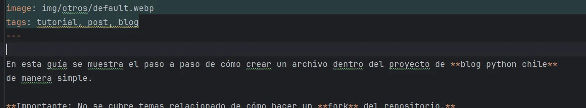
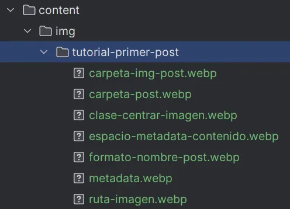

En esta guía se muestra el paso a paso de cómo crear un archivo dentro del proyecto de **blog python chile**
de manera simple.

!!! warning "⚠️ Cuidado"
    No se cubre temas relacionado de cómo hacer un fork del repositorio.

<br >

### 🚀 ¡Vamos por tu primer post!

Primero es crear un archivo markdown. Situado en la ruta raíz del proyecto, crea un archivo `.md` en la ruta `content/post/`:

{: .post-img}

El nombre del archivo `.md` debe tener el formato `AAAA-MM-DD-<titulo post>.md`:
{: .post-img}

<br >

Luego debes agregar al inicio del archivo la metadata:

{: .post-img}

Esta metadata es esencial para poder crear los **preview** de los post al inicio del blog.

Se debe respetar los caracteres `---` tanto al inicio como al final de la metadata y separando la metadata del contenido del post
con un **salto de línea**:

{: .post-img}

<br >

Una vez listo con la metada puedes **agregar tu contenido** ocupando formato __markdown__. Para más información puedes entrar a la siguiente [documentación](https://markdownguide.offshoot.io/basic-syntax/).

Dentro de tu contenido se puede agregar texto con el formato que se quiera, imágenes, código o cualquier otro elemento.

**Importante**: Todo contenido con estilo **personalizado** es permitido siempre y cuando no interfiera con el estilo global del blog. 
En este post no se cubre cómo peronsalizar el sitio entero.

<br >

Para agregar alguna imágen se hace con el formato ``:

{: .post-img}

Opcionalmente puedes agregar la clase `.post-img` para centrar la imagen (por defecto la imagen no estará centrada):

{: .post-img}

Toda imagen agregada al proyecto se debe guardar en la ruta `content/img/<nombre-post>/`:

{: .post-img}

Si quieres agregar una imagen ocupando una URL es el mismo formato mostrado anteriormente ``

<br >

También puedes agregar código que se pueda copiar:

    ```<nombre lenguaje>
    código de ejemplo aquí
    ```

Por ejemplo:

    ```python
    print("Tu primer post en Python Chile!")
    ```

Quedando como resultado:    

```python
print("Tu primer post en Python Chile!")
```

!!! note "Bloque Código"
    Para que se muestre el código correctamente, asegúrate que esté del lado izquierdo del archivo, que no tenga tabs ni espacios.

<br >

Para ocupar info panels como `warning` o `note`:

```
!!! note 
    Este es un info panel tipo **note**
```

!!! note 
    Este es un info panel tipo **note**

Puedes agregar un título también:

```
!!! note "🪐 Titulo ejemplo" 
    Este es un info panel con título tipo **note**
```

!!! warning "🪐 Titulo ejemplo" 
    Este es un info panel con título tipo **warning**

<br >

Confirma que se visualice bien el post a medida que lo vayas modificando:

```bash
# para crear archivos de sitio estático
pelican content
```

```bash
# para levantar localhost http://127.0.0.1:8000 
pelican -l
```

Ya teniendo todo listo 👌, puedes proceder a abrir una **pull request** y esperar la ✅️revisión para que se pueda agregar 
tu post al blog de Python Chile.

Para saber más sobre cómo contribuir al blog visita la [documentación oficial](https://github.com/python-chile/blogpythonchile?tab=contributing-ov-file#readme).

### Si has llegado hasta aquí... ¡Muchas gracias por tú interés 🎉🎉!
